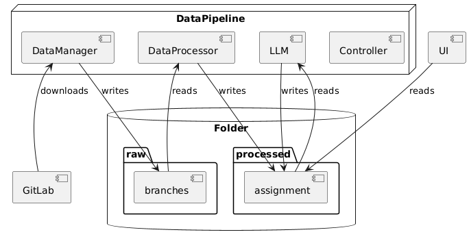
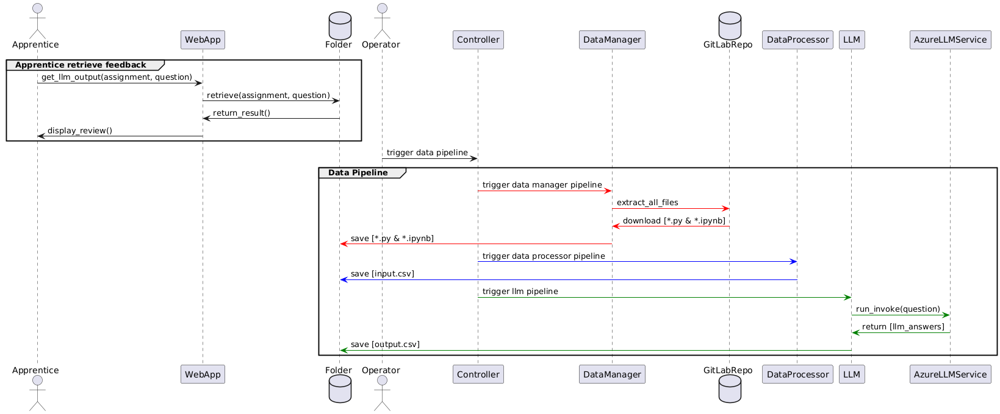

# NoteWorthy

This product was created during the 2 days mini project deep skilling phase at AIAP.

## Project Motivation
In the journey of learning and development at AIAP, individual feedback is crucial, yet often scarce and intimidating to seek. What if you could gain valuable insights by learning from the work of your peers, without the inefficiencies of manual notebooks review?


## Product Description
_A tool to help apprentices get insights into fellow apprentices’ .ipynb notebooks_


Unlock the full potential of collaborative learning with NoteWorthy, a tool designed specifically for AIAP apprentices. NoteWorthy simplifies the process of gaining insights from peer notebooks, making it an essential companion for any apprentice eager to enhance their skills and knowledge.

Product Features
- **Organised Aggregation:** NoteWorthy collects and organises all markdown and code responses from apprentices, efficiently compiling the data for each question in their notebooks.

- **Intelligent Summarisation:** Leveraging advanced Large Language Models (LLMs), NoteWorthy summarises the compiled markdown and code responses. This ensures you receive concise and actionable feedback, highlighting key insights and areas for improvement.

- **Enhanced Learning Experience:** By reviewing summarised responses and exemplary code from your peers, you can easily identify best practices, understand diverse approaches, and enhance your own notebooks.

## Demo


## Architecture

### High Level


<br>
<br>

Our pipeline architecture consists of 3 components:
- GitLab Extraction (extract .ipynb and .py)
- Data Extraction (extract code and markdown responses for each question)
- LLM Pipeline (generates the summarised code and markdown responses for each question)

<br>




## Usage
Login to registry
```
docker login registry.aisingapore.net
```

Run data pipeline docker image to extract .ipynb and .py content. After which perform data cleaning to obtain markdown responses and code responses for each question.

- Persistent data volume absolute path: refers to the path your output data folder. For example: *C:/Users/Joanna/Desktop/Courses/AIAP/noteworthy/data*

```
docker run `
    -v "<PERSISTENT DATA VOLUME ABSOLUTE PATH>:/home/aisg/noteworthy/data" `
    -e OPENAI_ENDPOINT='<YOUR_OPENAI_ENDPOINT>' `
    -e OPENAI_API_KEY='<YOUR_OPENAI_API_KEY>' `
    -e MODEL_NAME='<YOUR_MODEL_NAME>' `
    -e MODEL_VERSION='<YOUR_MODEL_VERSION>' `
    -e OPENAI_API_VERSION='<YOUR_OPENAI_API_VERSION>' `
    -e GITLAB_TOKEN='<YOUR_GITLAB_TOKEN>' `
    registry.aisingapore.net/aiap16-dsp/noteworthy/noteworthy-main:0.1.0 `
    /bin/bash -c "python -u src/main.py"
```

Run web application docker image
```
docker run `
    -v "<PERSISTENT DATA VOLUME ABSOLUTE PATH>:/home/aisg/noteworthy/data" `
    -p 8501:8501 `
    registry.aisingapore.net/aiap16-dsp/noteworthy/noteworthy-streamlit:0.1.0
```

### Configuring parameters

These are the parameters in our config.yml file. You can change the parameters directly within the docker run command
```
start_assignment: 4
end_assignment: 4
temperature: 0
max_tokens: 518
top_p: 0.8
batch_size: 5  # Define the batch size
delay: 5  # Define the delay between batches in seconds
log_level: INFO
```

For example, if you want to extract assignment 4 to 8, you can modify the bash command
```
docker run `
    -v "<PERSISTENT DATA VOLUME ABSOLUTE PATH>:/home/aisg/noteworthy/data" `
    -e OPENAI_ENDPOINT='<YOUR_OPENAI_ENDPOINT>' `
    -e OPENAI_API_KEY='<YOUR_OPENAI_API_KEY>' `
    -e MODEL_NAME='<YOUR_MODEL_NAME>' `
    -e MODEL_VERSION='<YOUR_MODEL_VERSION>' `
    -e OPENAI_API_VERSION='<YOUR_OPENAI_API_VERSION>' `
    -e GITLAB_TOKEN='<YOUR_GITLAB_TOKEN>' `
    registry.aisingapore.net/aiap16-dsp/noteworthy/noteworthy-main:0.1.0 `
    /bin/bash -c "python -u src/main.py start_assignment=4 end_assignment=8"
```

## Future Developments
- Suggested roadmap: Implemented for `.ipynb` notebooks; to implement similar feature for `.py` files
- To expand to include feedback/constructive criticism